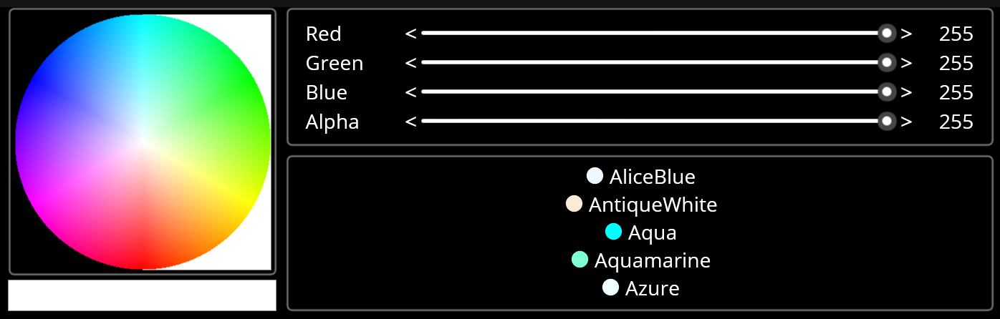

## ColorSelector
Experiment with Maui color selector.

The Color selector provides a user interface that supports choosing a color by name, by RGBA or by selecting a pixel in a color wheel.

Additionally, when using the color wheel or RGBA sliders, if the underlying ARGB values match a named color, it is selected in the color list. This is useful for cases where you prefer a named color over an RGBA value. 

Note that this code is an experiment and has only been run on the Windows platform. 

There are three experimental components:

### ColorSlider
This is a ContentView that presents the name of the color field, a slider for updating the value, increment and decrement actions, and a label with the associated value.

It uses Controls\Labels.cs to ensure the label fields are the same width across ColorSlider controls.

### ColorWheel
The ColorWheel provides a generated color image to select a color. It depends on SkiaSharp for image generation and GetPixel.

See Controls\ColorWheel.cs

### Controls\Label
Derives from Maui label and adds a DesiredWidth property to ensure labels are the same size across Grids.

Label overrides Control.MeasureOverride to calculate the desired width using TextUtilities.MeasureText.  Its usage can be seen in ColorSlider.xaml for the name and value labels.

See Controls\Label.cs

### TextUtilties
Provides a wrapper around SkiStringSizeService to measure text. This is a 'very rough' proof of concept.

See Model\TextUtilities.cs

## There are a number of helper classes under Model

### SelectionList.cs
Provides a list with a SelectedItem property. It implements IReadOnlyList<T> and INotifyCollectionChanged and is useful for data binding to a ListView

### HSBColor
Provides an HSB color class with conversions to and from Color.  Currently, this is used to generate the ColorWheel image.

### NamedColor
Provides a Color+Name class useful for populating a selectable list of colors. It has Equal overrides for comparing against a NamedColor or a Color as well as FromColor and FromName methods.
It is used to populate the color list selector.

### ColorComparer
Provides an alternative to the default Maui Color.Equals and EqualityComparer<Color>.

Maui's Color class compares using a 'Nearly Equal' concept that causes problems when multiple
named colors have the same RGBA values or when selecting ARGB values.

## Other Notes
The example uses SyncFusion's sfListView class instead of Maui's ListView class.
This is to avoid [this issue](https://github.com/dotnet/maui/issues/13754) which results in significant perf impact on Windows when populating the list.

If you build the sample without a SyncFusion license, you will need to respond to a SyncFusion pop-up at startup.